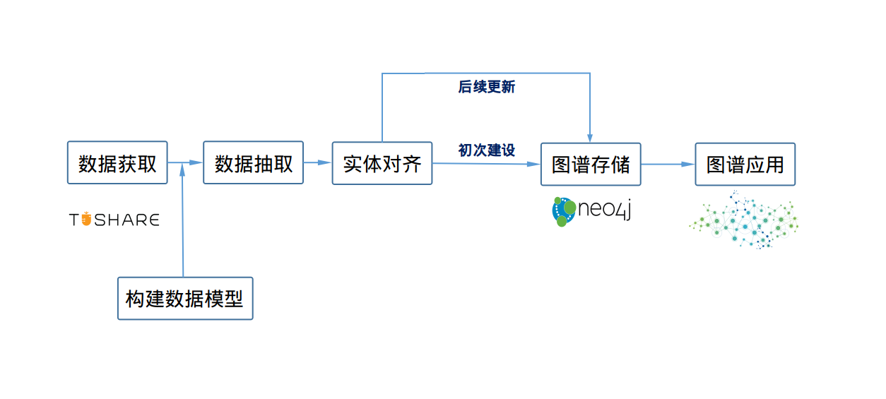
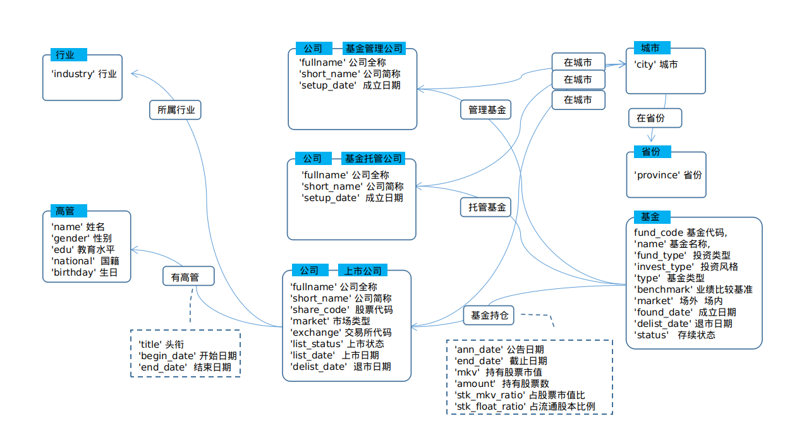
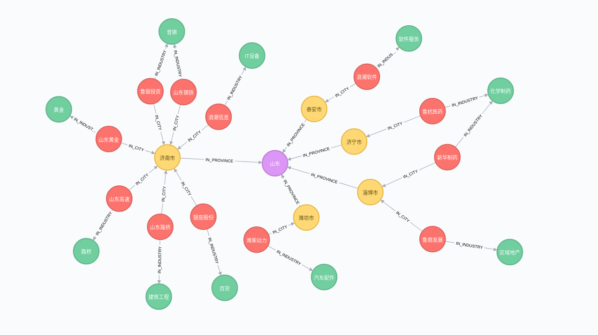

#  金融证券知识图谱搭建

本项目为基于 Python 中金融数据包 `TUSHARE` ，搭建一个金融证券知识图谱。
项目覆盖知识图谱 从 **初次搭建** 后续 **更新维护**
完整闭环。

整个项目结构如下：



## 项目结构

```
├──────────────────────────
├── data
├── data_update
├── pictures
├── README.md
└── scr
    ├── 1.get-data.ipynb
    ├── 2.graph-data-process.ipynb
    ├── 3.graph-data-to-database.ipynb
    ├── 4.application.ipynb.ipynb

```
注：相关数据下载后，解压到对应目录即可。

### 所用软件和版本
- neo4j:3.4.7   # 图数据库
- tushare:1.2.48      # 数据来源
- py2neo:4.3.0       # neo4j 的 python 库
- apoc: 3.4.03        # neo4j 工具包

## 一、数据获取

数据来源：TUSHARE

网站：https://tushare.pro/document/2

从 `TUSHARE`
的接口文档，对数据进行筛选。找出关联数据，这里我先选择以下**6**类数据。
- 股票列表
- 上市公司基本信息
- 上市公司管理层
- 公募基金列表
- 公募基金公司
- 公募基金持仓数据

## 二、构建数据模型

照节点和关系分别 - 构建数据模型

**实体(节点)方面**
1. 省份
2. 城市
3. 公司(上市公司 \ 基金管理公司 \ 基金托管公司)
4. 人（上市公司管理层）
5. 基金
6. 行业

**关系方面**
1. 城市 - [IN_PROVINCE] - > 省份 
2. 公司(上市公司\基金管理公司\ 基金托管公司) - [IN_CITY] - > 城市
4. 公司(上市公司) - [HAS_MANGER] - >
人（上市公司管理层）  [6类]
5. 公司(上市公司) - [IN_INDUSTRY] - > 行业
6. 基金  - [HAS_MANAGEMNET] - > 公司(基金管理公司)
6. 基金  - [HAS_CUSTODIAN] - > 公司(基金托管公司)
7. 基金  - [IN_PORTFOLIO] -> 公司(上市公司)



## 三、数据抽取

基于数据模型，完成数据抽取，并按照neo4j的 neo4j-admin import 的格式要求，保存文件。

## 四、实体对齐

将部分同一实体的不同名称，进行对齐，统一。
对于缺失信息尝试补全

## 五、图谱存储

将数据导入 neo4j 图数据库。并完成相关索引创建，提高图谱查询效率。

|类型|标签|数量|
|--|--|--|
|省份|PROVINCE|32|
|城市|CITY|341|
|基金|FUND|11045|
|高管|MANAGER|163613|
|行业|INDUSTRY|110|
|公司|COMPANY|19000|
|上市公司|LISTED_COMPANY|3773|
|基金管理公司|FUND_MANAGER|15292|
|基金托管公司|FUND_CUSTODIAN|40|
|**合计**|-|**213246**|

## 六、图谱应用

下面是应用部分。主要从两个方面展开
### 6.1. 可视化
利用 neo4j 自带的可视化插件进行
**查看山东国资背景的上市公司，在城市和行业上的分布情况。**

```cypher
MATCH p1 = (a:LISTED_COMPANY)-[:IN_INDUSTRY]-(b:INDUSTRY) 
    WHERE
a.share_code in
["600022","600547","600223","600858","600350","000498","000338","000977","600756","600784","000756","600789"]
MATCH p2 = (a)-[:IN_CITY]-(c:CITY)-[:IN_PROVINCE]-(d:PROVINCE) 
return p1,p2
```



### 6.2. 关联查询

利用 neo4j 的查询语言 `Cypher` 进行相关查询。
关系图谱的一个很重要的应用就是为上层应用和服务提供图查询结构，并返回对应关联数据。
比如推荐系统、以及风控场景下的关联排查等。

下面举三个例子，具体代码见程序
`4.application.ipynb`

#### 6.2.1. 江苏省 最受 基金 欢迎（持仓最多）的上市公司

#### 6.2.2. 上市公司高管董事之间的兼任情况

#### 6.2.3. <a color=red>基金推荐：</a> 根据某个基金持仓在不同行业的分布情况，基于此推荐与其持仓行业最相似的 Top5 基金。

## 七、图谱更新

待续
